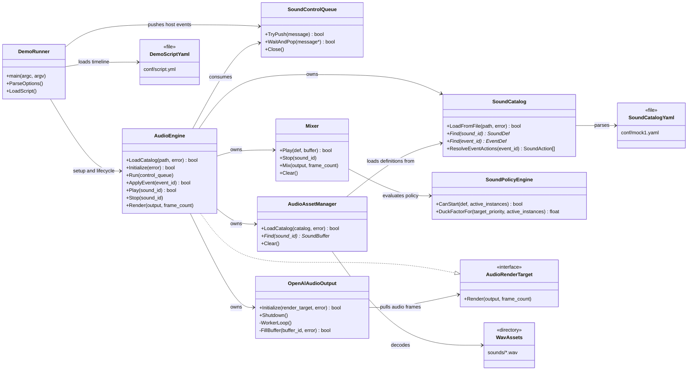
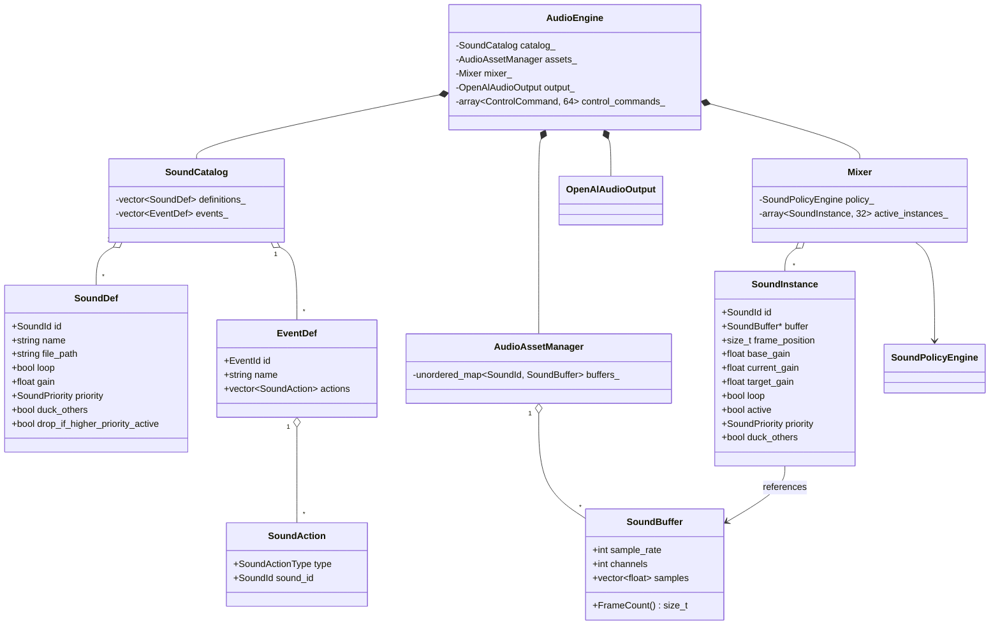
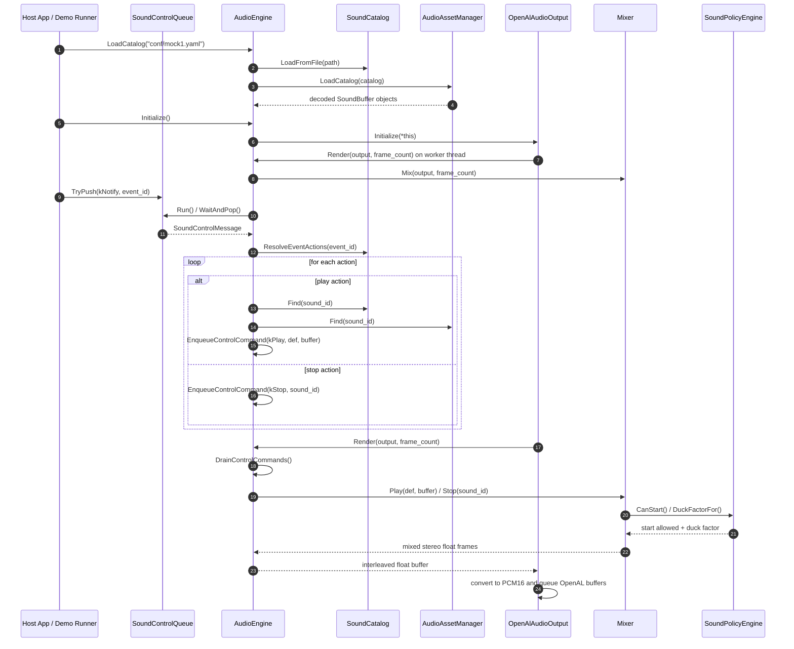
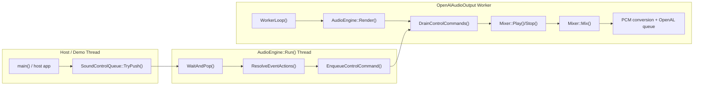

# Architecture UML

These diagrams reflect the current code structure in `src/` and the YAML-backed
runtime configuration used by `AudioEngine`.

## Component Diagram

## Core Class Diagram

## Event-To-Audio Sequence

## Threading / Runtime View

## Notes

- `AudioEngine` is the façade and the only component that spans config loading,
  host event handling, non-blocking control dispatch, mixing, and output.
- `SoundControlQueue` is the host-facing blocking queue.
- `AudioEngine` also owns a separate fixed-size single-producer/single-consumer
  ring buffer for render-thread-safe play/stop commands.
- `Mixer` owns active playback state and stays allocation-free during mix.
- `SoundPolicyEngine` decides suppression and ducking independently of the audio
  backend.
- `OpenAlAudioOutput` pulls audio from `AudioRenderTarget` rather than pushing
  callbacks into `Mixer` directly.
